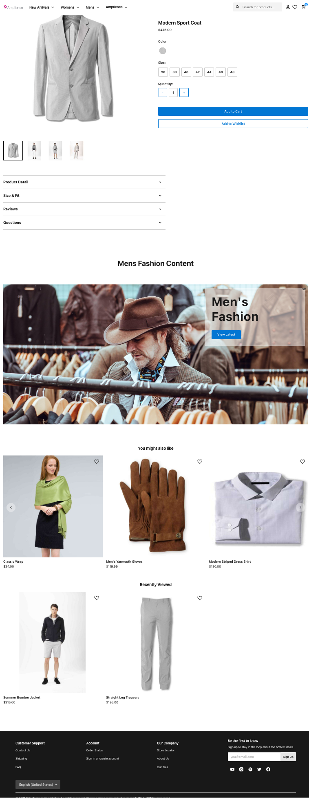

# Product Details Page (PDP) management

PDP's are often the main point of entry to a site. But they are typically hard to manage and lack any content due to their complexity.

## Key differences

### Default from SFCC Composable
The out of the box SFCC Composable Storefront from Salesforce displays product information from the commerce catalog.


### With Amplience
Amplience allows you to associate content to be displayed on the PDP. This can be one item or many items.



## Global Architecture choices
The vast majority of pages made up on a website are product details pages. There are 2 main considerations:

* Every product has a unique ID (SKU)
* These pages hold great SEO value so should be rendered server side.

In order to address the 2 points above, we have a new content type **Product PDP**. This has an enforced delivery key in a known format: `pdp/content/{SKU}`

This means that every PDP has a known method of fetching content that is relevant to that product from the application. This can be any content (individual, personalised, multiple items, content and/or slots)

An updated version of the PDP can be found in `app/pages/amplience/product-detail/index.jsx`.

This is updated to:
* Fetch content from Amplience with the matching key
* Check if it should be displayed
* Draws each content item linked in the **Product PDP** content type using the [AmplienceWrappper](./ampliencewrapper-component.md) component.

In getProps:
```javascript
let [productPdp] = await ampClient.fetchContent(
    [{key: `pdp/content/${productId.toUpperCase()}`}],
    {
        locale: targetLocale
    }
)
if (!productPdp?.active) {
    productPdp = undefined
}

return {category, product, productPdp}
```

Rendering:
```javascript
if (productPdp && productPdp.content) {
    let i = 0
    for (let content of productPdp.content) {
        productExtras.push(
            <AmplienceWrapper
                content={content}
                fetch={{id: content._meta.deliveryId}}
                key={`pdp-${i++}`}
            ></AmplienceWrapper>
        )
    }
}
```

## Visualisation
It is important to be able to visualise the content for a PDP as you are editing. Therefore can do the following:

* use the delivery key as a route
* have the content as a UseState so it can be redrawn if changed from [Real Time Visualisation](./visualization.md)

### Route

```json
{
    path: '/pdp/content/:productId', // For PDP visualisation
     component: AmpProductDetail
},
```

### UseState for Real Time Visualisation
```javascript
const [productPdp, setProductPdp] = useState(initialProductPdp)
useEffect(() => {
    setProductPdp(initialProductPdp)
}, [initialProductPdp])
```

